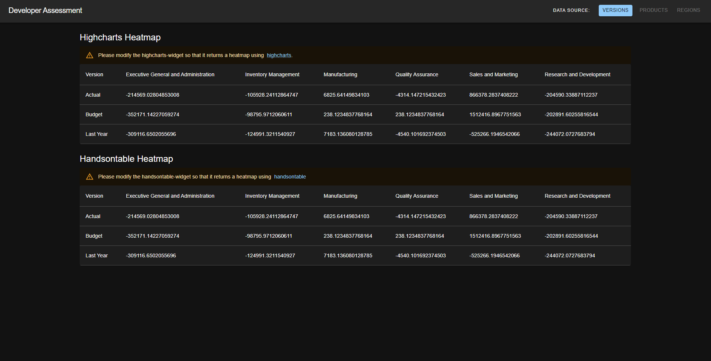

## Developer Skills Assessment

1. Install Node

2. Clone this repository to your local machine

3. Install Visual Studio Code (recommended)

4. Install the node package files

- To install the package files
  Run
  `>npm install`
  from the root folder of the cloned repository

5. Start the http server

- To start the http server
  Run
  `>npm start`
  from the root folder of the cloned repository

6. Open the application in your web browser

- To view the application please open the following url
  http://localhost:3000/

### Default web page

### Your task

Using the provided skeleton React application, please create a heatmap using highcharts and handsontable.

- [highcharts](https://www.highcharts.com/)
- [handsontable](https://handsontable.com/)

You will need to modify the files in the heatmap widget folder (./widget/heatmap).

1. Modify the HightchartsWidget to change the Material UI table to a highcharts heatmap.
2. Modify the HandsontableWidget to change the Material UI table to a handsontable that resembles a heatmap. (You do not need to show a legend with the handsontable heatmap.)

**Instructions**

1. You do not need to follow implemented architecture approach. You are able implement the architecture you think would be good in this case.
2. Do not use ClassComponents, use functional + react hooks instead
3. Do not change the structure of dataSource files
4. Use MaterialUI as design system library
5. Use ContextAPI instead of redux for a global state management (if needed).
6. Your solution should be scalable, please, implement it according to idea that application will grow

### Example heatmap

### Bonus tasks

If after main task you still have some time, you can implement bonus tasks.
Please, do not start with the bonus tasks till you finish the main one.

#### Data Sources

There are 3 buttons in the appbar of the app (Versions, Products, Regions).
These buttons match the names of dataSource files (./src/dataSources).

1. Implement data source file switch based on selected button in appbar
2. All related components should react on data source change an rerender with data from relevant data source file
3. Selected data source should be highlighted in appbar

#### Custom Heatmap Table

Implement custom heatmap table based on Material UI Table Component and render it at first postion on the main screen
